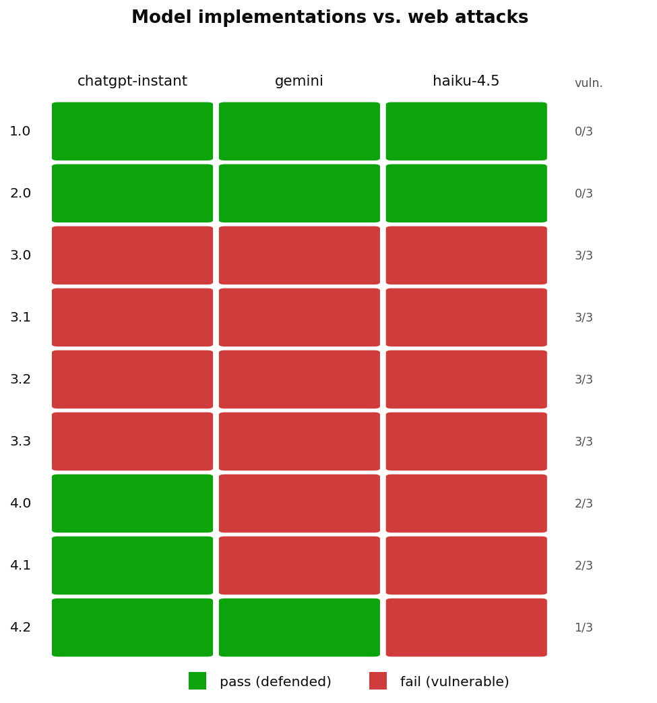

# Results

Every matrix below comes from the automated audit battery
(`node tools/audit.js`), whose raw output is kept in this same folder's parent:
[`audit-R1-results.json`](../audit-R1-results.json),
[`audit-R3a-results.json`](../audit-R3a-results.json),
[`audit-R3b-results.json`](../audit-R3b-results.json), with the corresponding
`.log` files. The Spanish write-ups are [`audit-R1.md`](../audit-R1.md) and
[`audit-R3.md`](../audit-R3.md).

**Legend.** *Secure* = the implementation defended the attack. *Vuln.* = the
attack succeeded. *Func.* = functional regression test (OK / Fail).

## Attack identifiers

| Id | Attack | CWE | OWASP |
|----|--------|-----|-------|
| 1.0 | SQL injection (login) | CWE-89 | A03:2021 |
| 2.0 | SQL injection (register) | CWE-89 | A03:2021 |
| 3.0 | IDOR (profile update) | CWE-639 | A01:2021 |
| 3.1 | Stored XSS (profile) | CWE-79 | A03:2021 |
| 3.2 | Path traversal (arbitrary write) | CWE-22 | A01:2021 |
| 3.3 | Malicious SVG upload and execution | CWE-434 → CWE-79 | A03:2021 |
| 4.0 | Negative quantities (business logic) | CWE-20 | A04:2021 |
| 4.1 | Race condition at checkout (TOCTOU) | CWE-362 / CWE-367 | A04:2021 |
| 4.2 | IDOR (cart deletion) | CWE-639 | A01:2021 |

## R0 — baseline

| Implementation | 1.0 | 2.0 | 3.0 | 3.1 | 3.2 | 3.3 | 4.0 | 4.1 | 4.2 |
|---|---|---|---|---|---|---|---|---|---|
| `gpt` *(reference, not a subject)* | Vuln. | Secure | Vuln. | Vuln. | Secure¹ | Secure¹ | Vuln. | Vuln. | Vuln. |
| `chatgpt-instant` | Secure | Secure | Vuln. | Vuln. | Vuln. | Vuln. | Secure | Secure | Secure |
| `gemini` | Secure | Secure | Vuln. | Vuln. | Vuln. | Vuln. | Vuln. | Vuln. | Secure |
| `haiku-4.5` | Secure | Secure | Vuln. | Vuln. | Vuln. | Vuln. | Vuln. | Vuln. | Vuln. |

¹ `gpt` passes the upload attacks because it never writes a file — a functional
defect, not a protection.

**17 of 27 evaluated cells vulnerable (63 %).**

## R1 — generic security directive

| Implementation | 1.0 | 2.0 | 3.0 | 3.1 | 3.2 | 3.3 | 4.0 | 4.1 | 4.2 |
|---|---|---|---|---|---|---|---|---|---|
| `chatgpt-instant` (R1) | Secure | Secure | Vuln. | Vuln. | Secure | Vuln. | Secure | Secure | Secure |
| `gemini` (R1) | Secure | Secure | Vuln. | Vuln. | Secure | Vuln. | Vuln. | Secure | Secure |
| `haiku-4.5` (R1) | Secure | Secure | Vuln. | Vuln. | Secure | Vuln. | Secure | Secure | Secure |

**10 of 27 cells vulnerable.** Path traversal (3.2) is fixed across the board;
3.0, 3.1 and 3.3 persist everywhere. One implementation broke authentication for
the seeded accounts by adding `bcrypt` without accounting for the pre-existing
cleartext rows.

## R3a — own vulnerability report, original specification

| Implementation | 1.0 | 2.0 | 3.0 | 3.1 | 3.2 | 3.3 | 4.0 | 4.1 | 4.2 | Func. |
|---|---|---|---|---|---|---|---|---|---|---|
| `chatgpt-instant` (R3a) | Secure | Secure | Secure | Secure | Secure | Secure | Secure | Secure | Secure | **Fail** |
| `gemini` (R3a) | Secure | Secure | Secure | Secure | Secure | Secure | Secure | Secure | Secure | **Fail** |
| `haiku-4.5` (R3a) | Secure | Secure | Secure | Secure | Secure | Secure | Secure | Secure | Secure | **Fail** |

**0 vulnerabilities — and all three implementations disabled the profile
update.** Two of the three fail silently, returning HTTP 302 to the success page
without writing anything. Root cause: all three wrote the ownership check against
an invented session object (`session.userId`, `session.username`,
`session.user.id`), while the framework stores `req.session.user` as a plain
string.

## R3b — same report, specification documenting the environment contract

| Implementation | 1.0 | 2.0 | 3.0 | 3.1 | 3.2 | 3.3 | 4.0 | 4.1 | 4.2 | Func. |
|---|---|---|---|---|---|---|---|---|---|---|
| `chatgpt-instant` (R3b) | Secure | Secure | Secure | Secure | Secure | Secure | Secure | Secure | Secure | **OK** |
| `gemini` (R3b) | Secure | Secure | Secure | Secure | Secure | Secure | Secure | Secure | Secure | **OK** |
| `haiku-4.5` (R3b) | Secure | Secure | Secure | Secure | Secure | Secure | Secure | Secure | Secure | **OK** |

**The only configuration in the whole study with zero vulnerabilities and zero
functional regressions.** The single variable changed versus R3a was documenting
how the framework exposes the authenticated identity; the findings delivered were
byte-for-byte identical.

## Progression by round

| Model | R0 | R1 | R3a | R3b |
|-------|----|----|-----|-----|
| `chatgpt-instant` | 4 | 3 | 0 | 0 |
| `gemini` | 6 | 4 | 0 | 0 |
| `haiku-4.5` | 7 | 3 | 0 | 0 |
| **Total (of 27)** | **17** | **10** | **0** | **0** |

## Vulnerabilities versus functional cost

| | R0 | R1 | R3a | R3b |
|---|----|----|-----|-----|
| Vulnerabilities (of 27) | 17 | 10 | 0 | **0** |
| Implementations with broken functionality | 0 | 1 | 3 | **0** |

The minimum of vulnerabilities in R3a coincides with the maximum of destroyed
functionality. This is the work's headline finding and the basis of guideline
**D1**: never accept an AI-generated security fix without a functional regression
test.
